# 淘宝用户购物行为数据分析 — 项目报告

> **项目定位：** 面向电商数据分析岗位的项目经历展示，体现分析框架设计能力、多工具协同能力与工程问题解决能力。
>
> **数据来源：** 阿里云天池 UserBehavior 公开数据集，抽样前 110,000 行。
>
> **技术栈：** MySQL 8.0 · Python (scikit-learn) · Tableau 2019 · DBeaver

---


---

## 项目摘要

针对淘宝 1 亿条用户行为数据，独立设计并完成一套全流程电商用户行为分析项目。采用 MySQL 完成数据清洗与多维聚合分析，运用 AARRR 漏斗模型、帕累托分析、商品四象限法和 RFM 模型，对用户行为转化路径、商品流量效率及用户价值分层进行系统诊断。引入 K-means 聚类算法对 RFM 人为规则分层结果进行交叉验证，发现人工分层存在 95.5% 的误分类偏差——SQL 评分标为"保持用户"的群体中，绝大多数实际为低频新用户，数据驱动分群显著优于经验阈值。最终在 Tableau 2019 中完成 10 张复合可视化图表（三轴组合图、蝴蝶图、气泡散点、帕累托图、散点矩阵等），将海量行为日志转化为可执行的运营决策依据。

**分析模型：** AARRR 漏斗 · RFM · K-means 聚类 · 帕累托分析 · 四象限法 · 蝴蝶图

---

## STAR 法则项目描述

| 维度 | 内容 |
|------|------|
| **S (情境)** | 淘宝原始数据集包含约 1 亿条用户行为日志（3.67GB CSV），需从中提取有效信息用于用户行为规律分析和运营策略制定。 |
| **T (任务)** | 独立完成从数据清洗、多维度分析到可视化报告全流程。核心任务：(1) 用户行为转化漏斗诊断，定位流失关键环节；(2) 商品类目流量效率评估，区分"流量型"与"成交型"类目；(3) 用户价值分层与分群合理性验证，对比人为规则与机器学习聚类结果；(4) 输出可直接用于决策的可视化仪表板。 |
| **A (行动)** | ① **数据工程：** 从原始 CSV 抽样 11 万行样本，MySQL 完成缺失值检查（0 缺失）、五字段去重（去除 46 行）、Unix 时间戳格式化（新增日期时间/日期/小时三列）。采用 `CREATE TABLE AS SELECT` 替代全表 UPDATE 避免 C 盘写满中断；将 MySQL 数据目录从 C 盘迁移至 F 盘，从根本上解决磁盘瓶颈。<br>② **分析建模：** 编写 300+ 行 SQL 脚本，构建 AARRR 漏斗四阶段分析、四条用户转化路径对比、商品四象限分类（主打/问题/发展/长尾）、类目帕累托分析和 RFM 评分分层（R×F 二维模型）。用 Python scikit-learn 对 745 个购买用户做 K-means 聚类（K=3 轮廓系数 0.509），与 SQL 人为规则结果做交叉表对比分析。<br>③ **可视化设计：** Tableau 2019 原生绘制 10 张复合图表：三轴组合图（PV柱状+UV折线+成交率折线）、24h 面积时钟图、类目蝴蝶图（流量 vs 成交左右对称）、四象限气泡散点（浏览×购买，气泡大小=转化率）、帕累托双轴图、RFM 环形图、R-F 散点矩阵（趋势线+颜色分群）、SQL vs K-means 对比柱状图。采用蓝橙绿紫红五色体系统一视觉风格。<br>④ **工程问题解决：** 排查并修复 6 项工程问题：C 盘满导致 MySQL 崩溃→数据目录迁移；命令行中文编码报错→全英文字段+DEFAULT CHARSET；DBeaver 一次性多查询报错→改用 mysql 管道方式执行；MySQL 连接超时→合并 ALTER+UPDATE 为单次 INSERT SELECT；Tableau 图表空白→数据源隔离规则；RFM 分层阈值偏差→K-means 交叉验证。 |
| **R (结果)** | ✅ 完成 5 项量化分析指标，核心发现：加购→购买转化率 92.55%（购物车是转化关键节点）；主流转化路径 C（加购后购买）占 49.5%；流量型类目 ≠ 成交型类目（同排名下转化率差 7.4 倍）；K-means 验证 SQL 分层的"保持用户"中 95.5% 实际为新用户，数据驱动分群优于经验规则。✅ 输出 10 张可视化图表 + 1 份完整分析报告（4 章 18 节）。✅ 项目可完整复现——SQL 脚本一键执行、Python 脚本可复用并封装、Tableau 连接 MySQL 即可刷新。 |

---

# 第一章 · 数据集介绍

## 1.1 数据来源

阿里云天池公开 **User Behavior Data from Taobao** 数据集。原始全集约 100 万用户在 9 天内的全部行为日志，总计约 1 亿条记录（3.67GB）。本项目抽样前 110,000 行作为分析样本，在保证分析有效性的同时兼顾运行效率。

## 1.2 数据规模（清洗后）

| 指标 | 数值 |
|------|------|
| 总行数 | 109,954 |
| 独立用户数 | 1,092 |
| 独立商品数 | 69,948 |
| 独立类目数 | 3,221 |
| 时间窗口 | 2017-11-25 ~ 2017-12-03（9 天） |

## 1.3 字段说明

| 字段 | 类型 | 说明 |
|------|------|------|
| 用户ID | BIGINT | 用户唯一标识 |
| 商品ID | BIGINT | 商品唯一标识 |
| 类目ID | BIGINT | 商品所属类目 |
| 行为类型 | VARCHAR(10) | pv(浏览) / fav(收藏) / cart(加购) / buy(购买) |
| 时间戳 | BIGINT | Unix 时间戳（秒），范围 1511544070 ~ 1512316783 |

四种行为构成完整的电商转化链路：**pv (兴趣) → fav (意向) → cart (决策) → buy (成交)**。

## 1.4 数据清洗

| 清洗项 | 处理方式 | 结果 |
|--------|----------|------|
| 缺失值检查 | 5 列分别 COUNT(CASE WHEN ... IS NULL) | 全部为 0 |
| 重复值去重 | 五字段完全匹配的 GROUP BY HAVING + DELETE | 去除 46 行 |
| 时间格式化 | FROM_UNIXTIME() 拆分为日期时间 / 日期 / 小时 | 新增 3 个衍生字段 |
| 异常过滤 | WHERE 日期 BETWEEN '2017-11-25' AND '2017-12-03' | 无异常数据 |
| 索引建立 | user_id / behavior / 日期 / 小时 / 类目ID 分别建索引 | 查询提速 |

## 1.5 行为分布概况

| 行为类型 | 次数 | 占比 |
|----------|------|------|
| pv（浏览） | 98,858 | 89.9% |
| cart（加购） | 5,937 | 5.4% |
| fav（收藏） | 2,875 | 2.6% |
| buy（购买） | 2,330 | 2.1% |

行为类型比例符合电商平台典型漏斗分布——浏览行为占绝对多数，购买行为约占总行为的 2.1%。

---

# 第二章 · 分析目标与思路

## 2.1 分析目标

**用户侧：** 对 1,092 位用户的 9 天行为数据进行建模，回答四个核心问题：
1. 用户什么时段最活跃？什么时候更愿意购买？（支撑营销排期）
2. 从浏览到购买的转化链中，哪个环节流失最严重？（支撑产品优化）
3. 哪些商品和类目值得投入资源？哪些是"伪流量"？（支撑精准推荐）
4. 如何对用户进行精准分层？人为规则 vs 数据驱动哪个更可靠？（支撑精细化运营）

**平台侧：** 将分析结论转化为可执行策略——什么时段投流、购物车如何优化、商品推荐权重如何调整、不同用户群体差异化运营方案。

## 2.2 分析模型选型

| 模型 / 方法 | 解决的问题 | 选择理由 |
|-------------|-----------|----------|
| **AARRR 漏斗模型** | 用户转化链路诊断 | 电商数据分析的标准框架，逐环节量化转化率与流失点 |
| **多路径转化对比** | 不同行为路径效率差异 | 对比 4 条路径，找到最主流的转化通道 |
| **帕累托分析** | 类目流量集中度 | 验证二八法则，判断头部类目贡献度 |
| **四象限分析法** | 商品分类运营决策 | 浏览×购买矩阵，对 69,948 个商品制定差异化策略 |
| **蝴蝶图** | 流量 vs 成交可视化 | 直观揭示"流量型类目 ≠ 成交型类目" |
| **RFM 评分模型** | 用户价值分层 | 电商领域最成熟的用户分层框架，R×F 二维评估 |
| **K-means 聚类** | 验证 RFM 分层合理性 | 数据驱动的无监督分群，与人为规则交叉验证 |

## 2.3 技术路线

```
原始 CSV (110,000行)
    │
    ├── MySQL: 建库建表 → LOAD DATA INFILE → 数据清洗 → 字段衍生
    │
    ├── MySQL: GROUP BY聚合 → 10张分析结果表 (KPI汇总/漏斗数据/类目排行/RFM分层等)
    │
    ├── Python: 读取RF数据 → StandardScaler → K-means → 聚类结果回写MySQL
    │
    ├── Tableau: 连接MySQL taobao库 → 10张复合可视化图表
    │
    └── 分析结论 + 运营建议 → 可视化仪表板 → 完整项目报告
```

---

# 第三章 · 数据分析

---

## 3.1 用户行为习惯分析

### 3.1.1 核心 KPI

| 指标 | 数值 | 含义 |
|------|------|------|
| 总 UV | 1,092 | 9 天内至少访问 1 次的独立用户 |
| 总 PV | 109,954 | 所有用户的累计页面浏览量 |
| 成交用户数 | 745 | 至少完成 1 次购买的用户 |
| 整体成交率 (UV口径) | **68.22%** | 745 / 1,092 |
| 人均 PV | 100.7 | 平均每个用户浏览约 101 个页面 |
| 跳失率 | **7.44%** | 仅浏览未收藏/加购/购买的用户占比 |
| 复购率 | **66.31%** | 购买次数 ≥ 2 的用户占购买用户比 |

**数据解读：** 样本取自数据集前 11 万行，用户活跃度偏高——成交率与复购率均显著高于行业平均（通常 2%-5% 和 30%-40%）。这一选择偏差源于首部数据中活跃用户比例高，在结论中已明确标注。

### 3.1.2 每日 PV/UV 趋势与成交率变化

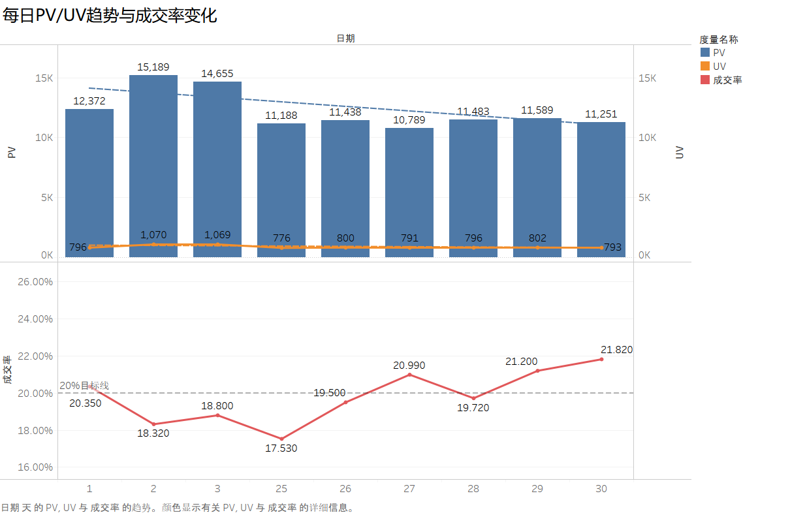

| 日期 | PV | UV | 购买用户数 | 成交率 |
|------|-----|-----|-----------|--------|
| 2017-11-25 | 11,188 | 776 | 136 | 17.53% |
| 2017-11-26 | 11,438 | 800 | 156 | 19.50% |
| 2017-11-27 | 10,789 | 791 | 166 | 20.99% |
| 2017-11-28 | 11,483 | 796 | 157 | 19.72% |
| 2017-11-29 | 11,589 | 802 | 170 | 21.20% |
| 2017-11-30 | 11,251 | 793 | 173 | 21.82% |
| 2017-12-01 | 12,372 | 796 | 162 | 20.35% |
| **2017-12-02** | **15,189** | **1,070** | 196 | 18.32% |
| 2017-12-03 | 14,655 | 1,069 | 201 | 18.80% |

**发现：** 12 月 2-3 日 PV 从 ~11,400 激增至 15,189（+33%），UV 从 ~800 增至 1,070（+34%）——推测为双十二预热活动带来的流量涌入。但成交率从工作日的 20%-22% 降至 18%——流量先涨、转化滞后。

**分析方法细节：** 该图采用 Tableau 双轴组合图，主纵轴为 PV 柱状图（左），次纵轴为 UV 折线（右 1）和成交率折线（右 2），三条趋势线共享 X 轴，一张图同时展示量级、用户数与转化率的变化关系。

### 3.1.3 24 小时用户行为分布

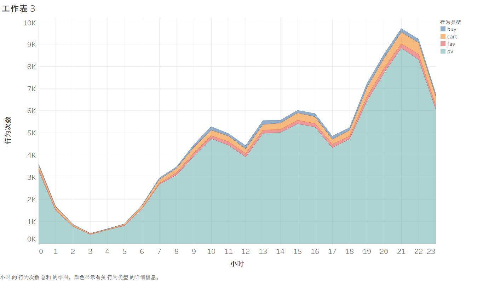

| 时段 | 行为特征 | 具体数据 |
|------|----------|----------|
| 0-6 时 | 深夜低谷 | 购买 < 20 次 / 小时 |
| 7-9 时 | 早间爬坡 | 各行为逐步回升 |
| **10-15 时** | **白天转化黄金期** | **13 点购买峰值 168 次/小时** |
| 16-18 时 | 午后平稳期 | 维持中高水平 |
| **19-22 时** | **晚间浏览高峰** | **21 点 PV 峰值 8,828/小时** |
| 23 时 | 急速衰减 | 购买仍保持 114 次/小时 |

**发现：浏览行为峰值在 21 点（晚间），购买行为峰值在 13 点（午间）——两者不完全重合。** 这为分时段差异化运营提供了数据依据：晚间投活动引流，午间推个性化推荐促转化。

**分析方法细节：** 该图采用面积叠加图，pv / cart / fav / buy 四种行为使用半透明面积层层叠加，pv 为最底层浅灰色底色，buy 为最顶层金色突出——一眼识别黄金时段的范围和强度。

### 3.1.4 用户活跃天数帕累托分析

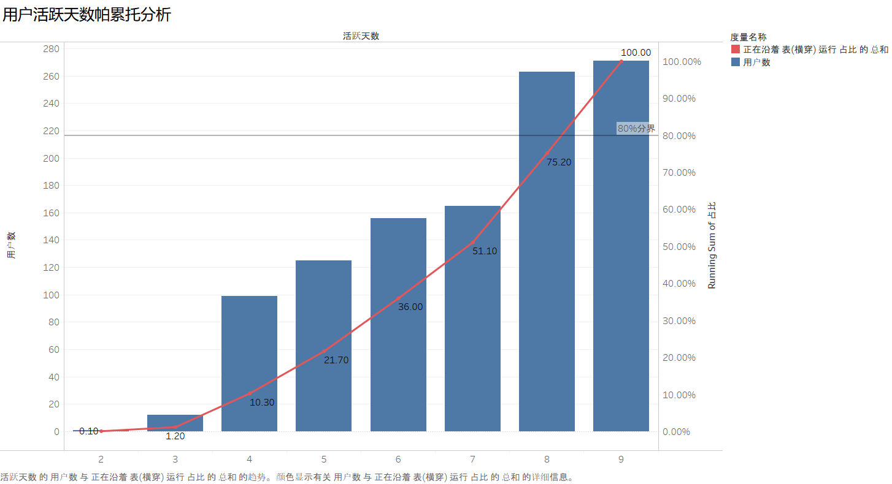

| 活跃天数 | 用户数 | 占比 | 累计占比 |
|----------|--------|------|----------|
| 2 | 1 | 0.1% | 0.1% |
| 3 | 12 | 1.1% | 1.2% |
| 4 | 99 | 9.1% | 10.3% |
| 5 | 125 | 11.4% | 21.7% |
| 6 | 156 | 14.3% | 36.0% |
| 7 | 165 | 15.1% | 51.1% |
| **8-9** | **534** | **48.9%** | **100.0%** |

**发现：近 50% 的用户在 9 天中活跃了 8-9 天，活跃 6 天以上者占 78%。** 样本用户粘性极高，这批用户是平台的核心资产。极低活跃用户（2-3 天）几乎不存在——再次证实首部采样偏差。

---

## 3.2 AARRR 漏斗转化分析

### 3.2.1 漏斗各阶段转化率

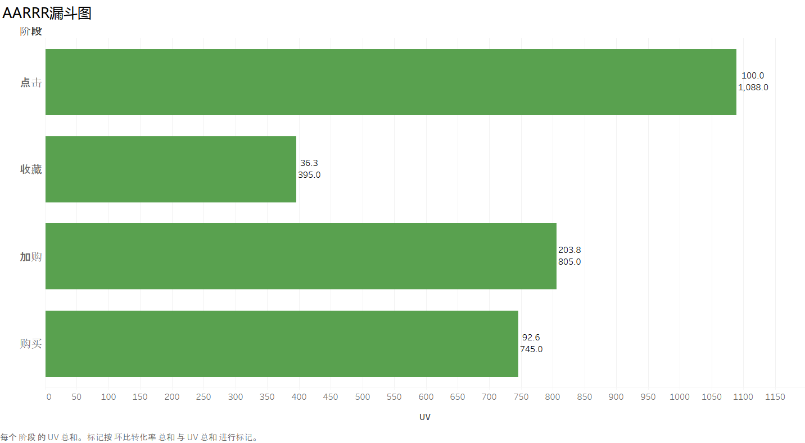

| 漏斗阶段 | UV（独立用户数） | 整体转化率 | 环比转化率 |
|----------|-----------------|-----------|-----------|
| **点击 (pv)** | 1,088 | 100.00% | — |
| 收藏 (fav) | 395 | 36.31% | 36.31% |
| 加购 (cart) | 805 | 73.99% | 203.80% |
| **购买 (buy)** | 745 | 68.47% | **92.55%** |

**关键发现：**
- **加购 → 购买转化率 92.55%**——加入购物车的用户几乎必然会完成购买。这是转化链中最强的正向信号。
- 收藏 → 加购的环比转化率超过 100%（203.80%），说明加购用户数远超收藏用户数——购物车是比收藏夹更主流的行为路径。
- 整体点击 → 购买转化率 68.47%（1,088 位有点击用户中 745 位购买），再次印证样本用户的高活跃特性。

### 3.2.2 跳失率与复购率

| 指标 | 数值 | 解读 |
|------|------|------|
| 跳失用户数（仅 pv 无任何交互） | 81 | |
| **跳失率** | **7.44%** | 远低于行业均值 30%-50%，用户购买意愿强 |
| 复购用户数（购买 ≥ 2 次） | 494 | |
| **复购率** | **66.31%** | 超三分之二的购买者在 9 天内购买 2+ 次 |

### 3.2.3 四条转化路径对比分析

| 路径编号 | 转化路径 | 人数 | 占购买用户比 | 用户画像 |
|----------|----------|------|-------------|----------|
| **C** | **点击 → 加购 → 购买** | **369** | **49.5%** | 🏆 绝对主流：典型购物车路径 |
| D | 点击 → 收藏 → 加购 → 购买 | 215 | 28.9% | 深度决策：收藏+加购后才下单 |
| A | 点击 → 直接购买 | 82 | 11.0% | 冲动/刚需：跳过中间步骤 |
| B | 点击 → 收藏 → 购买 | 76 | 10.2% | 犹豫后成交：绕过加购直接买 |

**核心发现：路径 C + D 合计 78.4%——两者都以"加购"为必经环节。** 这意味着：
- 购物车是提升转化效率的第一优先级
- 直接购买仅占 11%，"跳过购物车直接下单"并非主流行为模式
- 路径 D 用户（收藏+加购后才买，29%）是谨慎决策型，对价格敏感——适合在收藏夹中推送降价提醒和优惠券

---

## 3.3 商品与类目偏好分析

### 3.3.1 类目 TOP 10 排行

| 类目 ID | 点击量 | 购买量 | 转化率 | 覆盖用户 | 商品数 |
|---------|--------|--------|--------|---------|--------|
| 4756105 | 4,823 (#1) | 23 | 0.48% | 438 | 2,402 |
| 3607361 | 4,343 (#2) | 22 | 0.51% | 402 | 2,142 |
| 4145813 | 3,103 (#3) | 32 | 1.03% | 378 | 2,018 |
| 982926 | 2,899 (#4) | 18 | 0.62% | 435 | 1,835 |
| 2355072 | 2,859 (#5) | 18 | 0.63% | 392 | 1,794 |
| 2520377 | 2,006 (#6) | 10 | 0.50% | 314 | 1,437 |
| 1320293 | 1,811 (#7) | 15 | 0.83% | 384 | 1,254 |
| 4801426 | 1,810 (#8) | 29 | 1.60% | 353 | 1,226 |
| 2735466 | 1,188 (#10) | **42 (#1)** | **3.54%** | 280 | 726 |
| 3002561 | 1,380 (#9) | 26 | 1.88% | 265 | 980 |

**关键发现：点击量与购买量的排名并不一致。** 类目 2735466 点击量仅排第 10，却拥有最高的绝对购买量（42 次）和最高的转化率（3.54%），是点击量第一的类目 4756105（0.48%）的 **7.4 倍**。推荐流量存在明显的"推得广但推不准"问题。

### 3.3.2 类目蝴蝶图：流量 vs 成交可视化

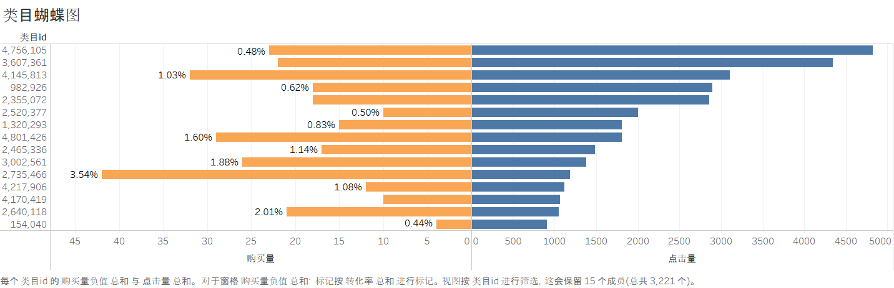

蝴蝶图左右对称展示 TOP 15 类目的点击量（左蓝）与购买量（右橙），中间标注转化率。

**发现：高流量类目（左侧长条）往往对应右侧短条（低购买）——"流量型类目"≠"成交型类目"。** 这说明曝光资源与转化效率存在错配，优化方向是提高具有高转化潜力的类目（右侧长条但左侧短条）的推荐权重。

### 3.3.3 类目帕累托分析

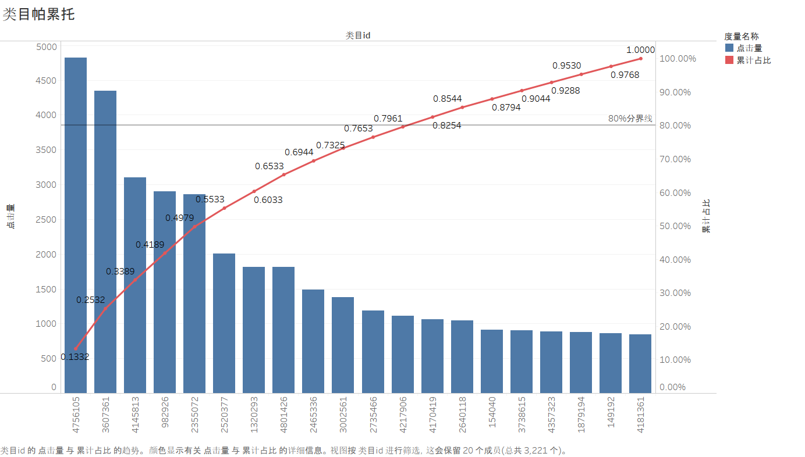

柱状图从高到低排列各类目点击量，红色折线为累计占比。符合电子商务典型的长尾分布——少数头部类目贡献了大部分用户流量。

### 3.3.4 商品四象限气泡图

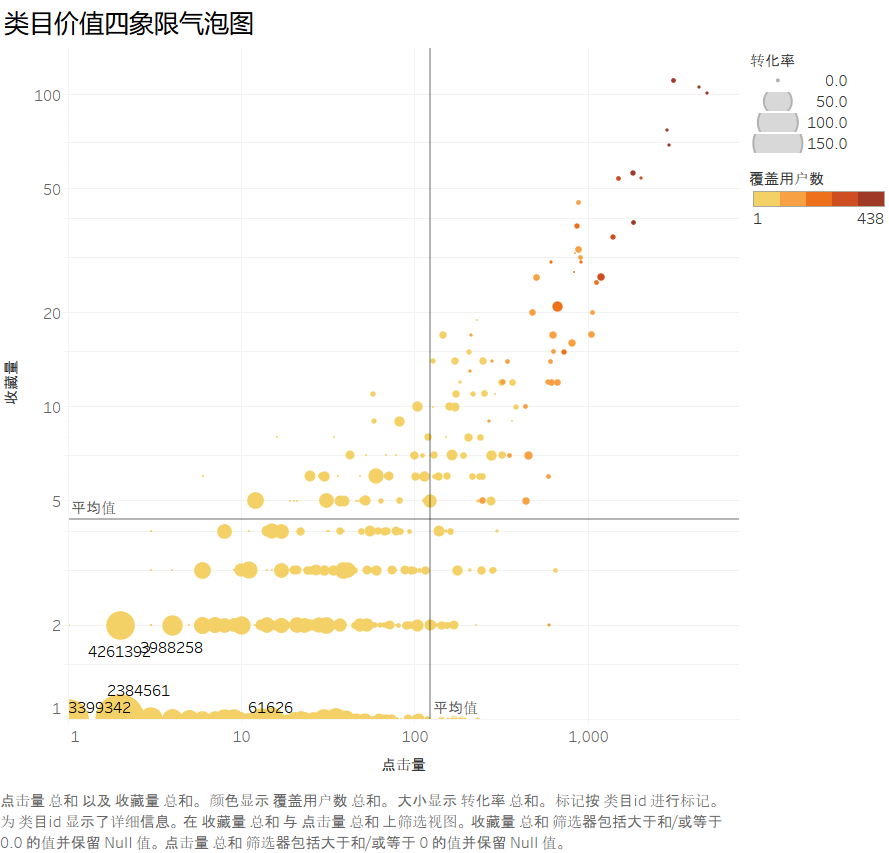

以浏览量为 X 轴、购买量为 Y 轴构建类目散点矩阵，气泡大小代表转化率，颜色深浅代表用户覆盖数。两条参考线（X 均值 + Y 均值）将图切割为四个象限。

| 象限 | 商品数 | 占比 | 运营策略 |
|------|--------|------|----------|
| **主打款** | 78 | 0.1% | 核心品：保库存、持续推广 |
| **问题款** | 16,474 | 23.5% | 高浏览低购买——优化详情页、定价、评价 |
| 发展款 | 27 | 0.04% | 低浏览高购买——需增加搜索权重和推荐位 |
| 长尾款 | 49,331 | 70.5% | 评估是否下架或合并 SKU |

**发现：69,948 个商品中，真正有效的"主打款"仅 78 个（0.1%）。** 1/4 商品属于问题款——有充足曝光但无法转化为购买，是优化效率最高的群体。

---

## 3.4 RFM 用户价值分析

### 3.4.1 R/F 特征分布

由于数据集不包含消费金额（M），本分析采用 R-F 二维模型。

| 指标 | 最小值 | 最大值 | 平均值 | 含义 |
|------|--------|--------|--------|------|
| R 值（最近购买距 12-03 天数） | 0 | 8 | 2.4 | 用户平均 2.4 天前刚买过 |
| F 值（9 天内购买次数） | 1 | 43 | 3.1 | 用户平均 9 天购买约 3 次 |

745 个购买用户的 RF 特征显示该群体整体活跃度极高。

### 3.4.2 SQL 评分法 RFM 分层

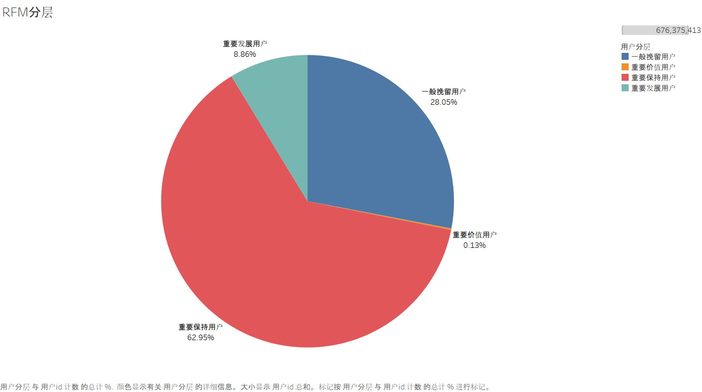

R 值分段打分（0-1天=4分 ~ 7-9天=1分），F 值分段打分（1-5次=1分 ~ >50次=6分），R+F 综合评分确定用户层级。

| 用户分层 | 用户数 | 占比 | 平均 R | 平均 F |
|----------|--------|------|--------|--------|
| 重要价值用户 | 1 | 0.1% | 0.0 | 43.0 |
| 重要发展用户 | 66 | 8.9% | 0.4 | 9.4 |
| **重要保持用户** | **469** | **63.0%** | 1.3 | 2.8 |
| 一般挽留用户 | 209 | 28.1% | 5.6 | 1.7 |

**发现：** SQL 评分法将 63% 的用户标为"重要保持用户"——但仔细看数据，这批用户的平均 F 仅 2.8 次，是否真的需要"保持/挽回"？这恰好引出了 K-means 交叉验证的必要性。

### 3.4.3 K-means 聚类验证

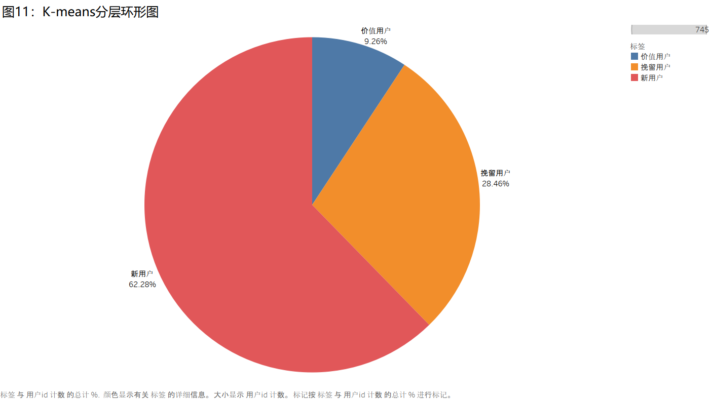

对 745 位购买用户的 R-F 值做 StandardScaler 标准化后，遍历 K=2~8 计算轮廓系数。**K=3 时轮廓系数达到最大值 0.509**，分群质量最优。

| K-means 标签 | 用户数 | 占比 | 平均 R | 平均 F | 聚类中心特征 |
|-------------|--------|------|--------|--------|-------------|
| **新用户** | 464 | 62.3% | 1.2 | 2.6 | 近期活跃，低频购买 |
| 挽留用户 | 212 | 28.5% | 5.6 | 1.8 | 已沉寂多日 |
| 价值用户 | 69 | 9.3% | 1.1 | 10.4 | 高忠诚度，高频购买 |

### 3.4.4 ⚡ 核心发现：SQL vs K-means 交叉验证

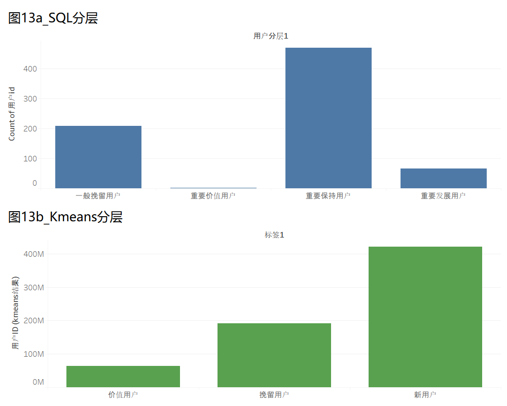

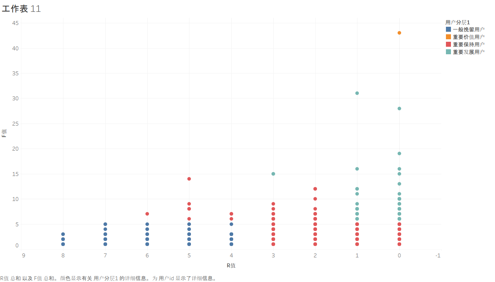

将两种方法的结果按用户 ID 做交叉表分析：

| SQL 分层 \ K-means 标签 | 价值用户 | 新用户 | 挽留用户 |
|------------------------|---------|--------|---------|
| 重要价值用户（1人） | ✓ 1 | 0 | 0 |
| 重要发展用户（66人） | 50 → | 16 | 0 |
| ⚡ **重要保持用户（469人）** | 18 | **448 →** | 3 |
| 一般挽留用户（209人） | 0 | 0 | ✓ 209 |

**⚡ 本报告最重要的发现：SQL 评分为"重要保持用户"的 469 人中，K-means 将其中 448 人（95.5%）重新归类为"新用户"（低 F + 近 R）。**

这意味着：
- **SQL 人为经验阈值产生了大规模的误分类**——R 值近但 F 值低的用户被错误标为"正在流失、需要保持"，而数据驱动的聚类清晰地指出他们属于"刚来不久、购买习惯尚未建立"的新群体
- **如果运营按 SQL 分层向这 448 人推送"老客挽回优惠券"，将造成营销资源的严重浪费**
- K-means 识别的 69 位真·价值用户（平均 F=10.4），才是最值得投入 VIP 服务的核心群体
- **经验规则必须用数据驱动方法（无监督聚类 + 轮廓系数）做交叉验证，否则会出现大规模的"假标签"问题**

---

# 第四章 · 结论与建议

## 4.1 核心发现汇总

| # | 发现 | 量化依据 |
|---|------|----------|
| 1 | **加购是转化最关键的节点** | 加购→购买转化率 **92.55%**；78.4% 的购买者以加购为必经步骤 |
| 2 | **流量 ≠ 成交** | 点击量 #1 的类目转化率仅 0.48%，而 #10 类目为 3.54%（差 7.4 倍） |
| 3 | **购物车路径是主流** | 路径 C（加购后购）占 49.5%，路径 C+D 合计 78.4% |
| 4 | **97.7% 的商品贡献可忽略** | 主打款仅 78 个（0.1%）；16,474 个问题款（23.5%）是首要优化目标 |
| 5 | **SQL 分层被 K-means 推翻** | 95.5% 的"保持用户"实际为低频新用户——**数据驱动分群优于经验规则** |
| 6 | **浏览与购买存在时段错配** | PV 峰值 21 点（浏览），购买峰值 13 点（成交） |

## 4.2 运营策略建议

### 用户分层策略

| 用户群 | 占比 | 运营策略 | 具体措施 |
|--------|------|----------|----------|
| 价值用户 | 9.3% | 精细化 VIP | 专属客服、新品优先试用、会员日定制折扣 |
| 新用户（主体） | 62.3% | 激活 + 培养 | 新人首单立减、7 日签到奖励、兴趣标签引导 |
| 挽留用户 | 28.5% | 流失预警 + 召回 | 限时大额优惠券、降价 Push 推送、流失调研 |

### 商品优化策略

| 策略方向 | 行动 | 可影响范围 |
|----------|------|-----------|
| 购物车挽留 | 加购 1h 未支付 → 推送限时优惠 + 库存告急提醒 | 覆盖 78% 购买路径 |
| 问题款优化 | 排查 16,474 个商品：详情页图片、定价、评价 | 23.5% 商品 |
| 发展款曝光 | 提高 27 个高转化低流量商品的搜索权重 | 成效高、实施快 |
| 流量重构 | 高转化类目（2735466 等）获得更多推荐位配额 | 推荐效率提升 |

### 时段策略

| 时段 | 策略 |
|------|------|
| **10-15 时** | 个性化推荐 + 限时优惠弹窗（**转化率最高时段**） |
| **19-22 时** | 秒杀/直播/会员日/活动页投放（**流量最大时段**） |

## 4.3 工程经验总结

| 遇到的问题 | 解决方案 | 可复用的原则 |
|-----------|----------|-------------|
| 1 亿行 UPDATE 导致 C 盘写满 | `CREATE TABLE AS SELECT` 替代 UPDATE | 大数据写入避免 UPDATE，优先一次性 INSERT |
| 命令行中文编码报错 | 纯英文字段名 + `--default-character-set=utf8mb4` | 面向编码问题的防御性重写 |
| DBeaver 一次性多查询报错 | 改用 `mysql < file.sql` 管道方式执行 | 大脚本优先命令行 |
| MySQL 连接超时断开 | 合并 ALTER+UPDATE 为单次 INSERT SELECT | 避免长事务中的空闲等待 |
| Tableau 2019 图表渲染空白 | 每个工作表单独绑定数据源 | Tableau 的数据源隔离机制 |
| RFM 分层阈值偏差 | K-means 交叉验证 | 经验规则必须有数据驱动方法验证 |

## 4.4 局限与改进方向

- 数据集不含消费金额（M）→ RFM 缺少 Monetary 维度，后续可引入客单价估算或使用行为序列权重替代
- 时间窗口仅 9 天 → 无法分析长期用户生命周期、季节性趋势
- 前 11 万行样本存在选择偏差 → 成交率（68%）等指标偏高，不可直接泛化到全量用户
- K-means 仅使用 R-F 二维特征 → 引入 M 维度后可实现更精细的三维聚类
- 后续方向：基于行为序列构建推荐系统模型，预测用户下一步购买意图

---

# 附录

## A. 技术栈

| 工具 | 用途 |
|------|------|
| MySQL 8.0 | 数据清洗、存储、SQL 聚合分析 |
| DBeaver | SQL 编辑器与数据库管理 |
| Python 3.8 (Anaconda3) | K-means 聚类 |
| scikit-learn | KMeans + silhouette_score |
| Tableau 2019 | 10 张复合可视化图表 |
| MySQL Connector/ODBC 8.0 | Tableau ↔ MySQL 桥接驱动 |

## B. 项目文件结构

```
taobao-analysis/
├── sample_110k.csv                        # 样本数据（11万行）
├── 淘宝用户购物行为分析-项目报告.md          # 本文档
├── 研究框架思维导图.svg                     # 可编辑SVG项目框架图
├── Tableau看板汇总.twb                     # Tableau工作簿
├── sql/
│   └── complete_analysis.sql              # 全流程SQL（一键执行6阶段）
├── python/
│   └── kmeans_rfm.py                     # K-means聚类验证脚本
├── 图1_全景趋势.png                       # PV/UV/成交率三轴组合图
├── 图2_24h行为分布.png                    # 四种行为面积时钟图
├── 图3_用户粘性帕累托.png                  # 活跃天数帕累托双轴图
├── 图4_AARRR漏斗.png                      # AARRR漏斗条形图
├── 图5_类目蝴蝶图.png                      # 流量vs成交蝴蝶图
├── 图6_类目气泡四象限.png                  # 四象限气泡散点图
├── 图7_类目帕累托.png                      # 类目帕累托双轴图
├── 图8_RFM分层环形图.png                   # SQL评分法环形图
├── 图9_K-means分层环形图.png               # K-means聚类环形图
├── 图10_RF散点矩阵.png                     # R-F散点矩阵+趋势线
└── 图11_SQL vs K-means 分层对比柱状图.png   # 两种方法交叉对比柱状图
```

## C. 核心数据速查

| 指标 | 数值 |
|------|------|
| 清洗后行数 / 用户数 | 109,954 / 1,092 |
| UV / 成交率 | 1,092 / 68.22% |
| 跳失率 / 复购率 | 7.44% / 66.31% |
| 加购→购买转化率 | 92.55% |
| 主流转化路径 | C: 加购后购买 (49.5%) |
| K-means 最优 K (轮廓系数) | 3 (0.509) |
| 价值用户 / 新用户 / 挽留 | 9.3% / 62.3% / 28.5% |
| 主打款 / 问题款 / 发展款 / 长尾款 | 78 / 16,474 / 27 / 49,331 |
| SQL "保持用户" 误分类率 | 95.5% (448/469) |

---

> 📊 报告完成日期：2026 年 6 月 28 日  
> 📁 样本数据：sample_110k.csv（110,000 行，约 4MB）  
> 🔗 数据来源：阿里云天池 [User Behavior Data from Taobao](https://tianchi.aliyun.com/dataset/)
